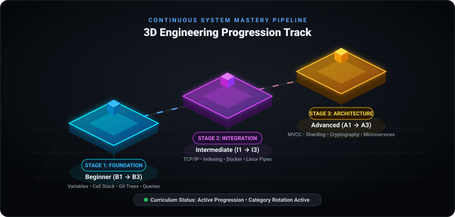
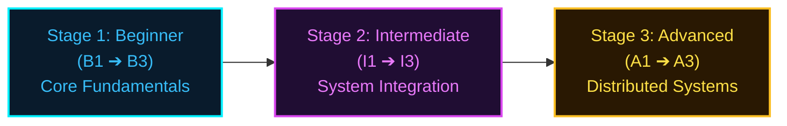

<div align="center">

# 📘 Dev Notebook

### Continuous Software Engineering Mastery & Technical Knowledge Base
*Curated by **[Aruthra07](https://github.com/Aruthra07)***

<p align="center">
  
  
  
  
</p>

<p align="center">
  
  
  
  
  
  
  
</p>

</div>

---

## 🚀 3D Curriculum Progression Track

A structured learning progression that moves systematically through fundamentals, integration mechanics, and distributed systems architecture.

<div align="center">
  
</div>

---

## 🎯 Learning Philosophy & Structure

Every technical entry in this notebook follows a strict, high-signal, first-principles format designed for rapid recall and deep engineering intuition:

```
┌────────────────────────────────────────────────────────────────────────┐
│                        DAILY DEV ENTRY STRUCTURE                       │
├────────────────────────────────┬───────────────────────────────────────┤
│ 1. ❓ Question                 │ Direct engineering problem / mechanic │
│ 2. 💡 Short Answer             │ 2–5 sentence crisp, grounded answer   │
│ 3. 💻 Simple Example           │ Real-world code snippet or terminal   │
│ 4. 🔑 Key Point                │ Fundamental mental model to remember  │
└────────────────────────────────┴───────────────────────────────────────┘
```

---

## 📚 Curriculum Knowledge Matrix

Entries are categorized across 9 core engineering domains, ensuring broad foundational strength before deepening into specialized systems.

| Domain | Focus Areas | Status |
| :--- | :--- | :---: |
| 💻 **[Computer Science](computer-science/)** | Process vs Thread, Call Stack, Memory (Stack & Heap), Big-O, Hash Tables | 🟢 In Progress |
| 🐍 **[Programming](programming/)** | Python Variables & Typing, Functions, Mutable Objects, Exception Handling | 🟢 In Progress |
| 🌿 **[Git & Version Control](git/)** | Working Tree vs Staging, Object Hashing, Branching Pointers, Merging | 🟢 In Progress |
| 🗄️ **[Databases & SQL](databases/)** | Schema Design, Primary/Foreign Keys, B-Tree Indexes, ACID Transactions | 🟢 In Progress |
| 🌐 **[Networking](networking/)** | Client-Server Architecture, TCP/IP Stack, HTTP/HTTPS Lifecycle, DNS Resolution | 🟢 In Progress |
| 🕸️ **[Web Architecture](web/)** | REST Principles, Browser Rendering, Cookies & Sessions, Caching Layers | 🟢 In Progress |
| 🐧 **[Linux & Systems](linux/)** | Unix Filesystem Tree, Permissions (rwx), Standard Streams & Pipes, Daemons | 🟢 In Progress |
| 🐳 **[Docker & Containers](docker/)** | Container vs Image, Dockerfile Directives, Volumes, Port Bindings | 🟢 In Progress |
| 🛡️ **[Security Fundamentals](security/)** | Authentication vs Authorization, Cryptographic Salts, Principle of Least Privilege | 🟢 In Progress |

---

## 🗺️ Progression Milestones



* **Beginner Stage (B1 → B3)**: Focuses on establishing concrete mental models of execution, data types, version control, and basic querying.
* **Intermediate Stage (I1 → I3)**: Bridges concepts across networking, containerization, database indexing, and operating system calls.
* **Advanced Stage (A1 → A3)**: Explores distributed transactions, consensus, memory caching strategies, high-availability architecture, and security hardening.

---

## 👤 Author

**Aruthra07**
* GitHub: [@Aruthra07](https://github.com/Aruthra07)
* Email: [aruthramani785@outlook.com](mailto:aruthramani785@outlook.com)

---
<div align="center">
  <sub>Maintained continuously as an open developer notebook. Deterministic engineering curriculum.</sub>
</div>
